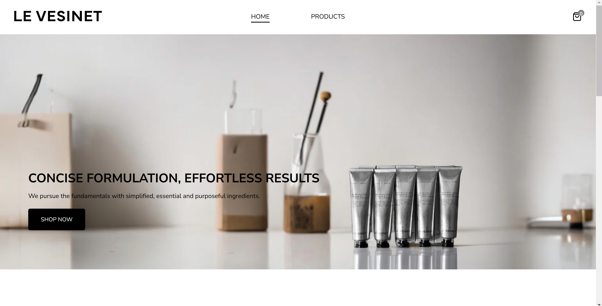
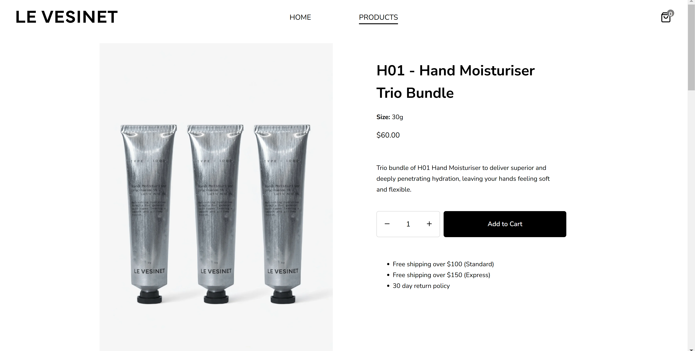
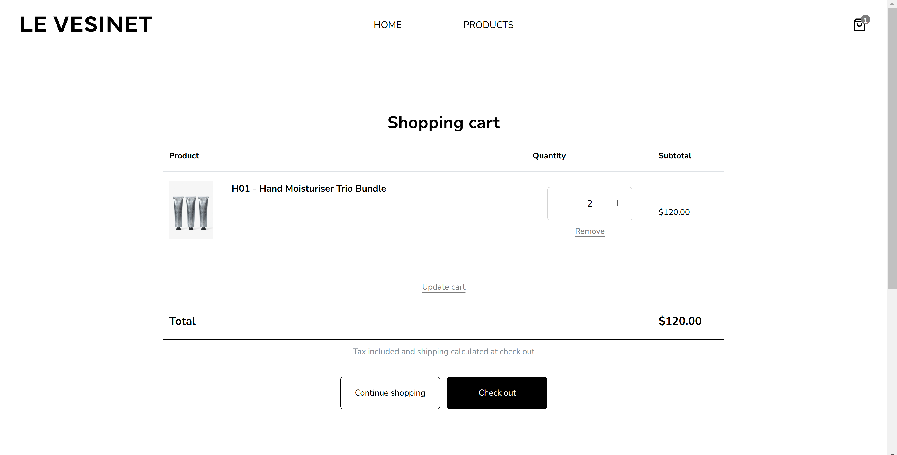

<!-- PROJECT SHIELDS -->

[![Issues][issues-shield]][issues-url]
[![LinkedIn][linkedin-shield]][linkedin-url]

<!-- PROJECT LOGO -->
 

  

  

     
    E-commerce site for men's skincare products.
     
     
    <a href="https://le-vesinet.netlify.app/" target="_blank">View demo</a>
    ·
    <a href="https://github.com/henrylin03/le-vesinet/issues/new" target="_blank">Add issue</a>
  

<!-- ABOUT THE PROJECT -->

## About

A stripped-down clone of [Le Vesinet](https://www.levesinet.com.au/)'s Shopify site, containing core features such as:

### Landing page

  

### Pages for individual products

  

### Shopping cart page

Try adding in <a href="https://le-vesinet.netlify.app/products" target="_blank">a product or two </a> first!

  

All pages and components are responsive on narrower screens. Currently, items added to cart are tracked using React state (`useState` hook) so will not persist through refreshes.

This project is part of [The Odin Project's](https://www.theodinproject.com/) "Full Stack JavaScript" course. Built in ReactJS, this project focuses on practising routing (React Router v6), automated testing (Vitest, React Testing Library), managing states across pages, and styling React apps (CSS modules).

### Built with

<!-- CONTRIBUTING -->

## Contributing

If you have a suggestion that would make this project better, please feel free to [add an issue](https://github.com/henrylin03/le-vesinet/issues/new) and/or fork and create a pull request.

## Acknowledgements

- [Karsten Winegeart](https://unsplash.com/@karsten116) on [Unsplash](https://unsplash.com/photos/brown-and-white-short-coated-dog-wearing-yellow-and-green-shirt-lying-on-orange-textile-ewfHXBcuFA0?utm_content=creditCopyText&utm_medium=referral&utm_source=unsplash) for the error page image
- [favicon.io](https://favicon.io) for generating the favicons
- The present README was heavily influenced by the ["Best-README-Template"](https://github.com/othneildrew/Best-README-Template)
- Markdown badges by [ileriayo](https://github.com/Ileriayo/markdown-badges)

(<a href="#readme-top">back to top</a>)

<!-- MARKDOWN LINKS & IMAGES -->

[issues-shield]: https://img.shields.io/github/issues/henrylin03/le-vesinet.svg?style=for-the-badge
[issues-url]: https://github.com/henrylin03/le-vesinet/issues
[linkedin-shield]: https://img.shields.io/badge/-LinkedIn-black.svg?style=for-the-badge&logo=linkedin&colorB=555
[linkedin-url]: https://www.linkedin.com/in/henrylin03/
